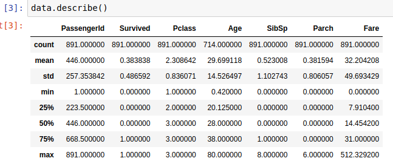

# Titanic Project
## Case Study
who would survive in the titanic accident
## titanic dataset from kaggle
=======
### Case Study
who would survive in the titanic accident
#### Titanic dataset from kaggle
we will get the dataset from  [Titanic dataset](https://www.kaggle.com/c/titanic/data) you can dowload it from kaggle.com
After downloading the dataset, you will need to extract it to the same folder as your ipython notebook file

### A recap on the Dataset
When you read the .csv file in by the pandas package in Python, it will read in as a table, with each line as a row and each comma separated item into different columns. by importing the packages, we see the dimensions of the dataset are:

#### import packages needed for the procedure
import pandas as pd

#### read data as data
data = pd.read_csv("train.csv")

#### check the dimension of the table
print("The dimension of the table is: ", data.shape)

##### The dimension of the table is:  (891, 12)
This shows that we have 891 rows and 12 columns. The rows represent the passager/crew and the column represent the passeger/crew information 

if we take a look at the first 5 rows 
`` data.head()``

when we look at the 5 rows we see that the data is a mixture of numerical ( passenger id, survived, pclass, age, sibsp, parch and fare) and categorical data(sex, cabin, embarked) and text data(name, ticket)

### Exploratory data analysis
EDA is used to explore the target and features so we know if we will need to transform or normalize some of the features based on their distribution

*For data visualization we will use matplotlib and yellowbrick*

There some questions that we should answer then we answer them with figures and tables.

1. What variables do we have?, are they categorical or numerical data what are there distribution
2. Are the numerical variables corelated
3. Is the distribution of the numerical variables the same among the SUrvived and Not-survived or different?
4. The different survival rates eg. did more women survive than men?

### understanding the variables

if we check the summary of the data  (data.describe())   we see things like the  average, mean, ,standard deviation, min and max values.

 However from the count of data we see that there are values missing in the age column  714 instead of 891

we also see the categorical data like in 'sex' there are only 2 categories i.e male and female

## Histograms for the numerical variables (AGE, SIBSP, PARCH and FARE)

from the histogram we see that most of the passegers are in the age of 20 and 30 years old and dont have siblings with them. 
a large amount of tickets sold were less than $50 meaning many were in the economy class as well as travelling to the closest destination

### barplot for the categorical data  i.e survived,  sex, pclasss and embarked    
code below

from the bar plot we see that there were more male than female 
many were traveling to southampton as well as many were in the 3rd class. and many did ont survive

### Are the numerical data correlated
to see if there is correlation of  numerical values we will create a pearson ranking visualization where we see that the correlation between the variables was low (<0.5)

### Differences in the distribution of the numerical values among the survived and not survived 
to see if there are significant differences we are using the parallel coordinates visualization

from the output we see that the passegers with more siblings have a higher death rate.And those that paid a higher fare had a higher survival rate.

### Difference in survival rates for the categorical data using the  faceted stacked bar plot.

 from the plots,  more females survived than men and death rate is much higher in the 3rd class and embarkation from southampton port. 

### Feature selection and feature engineering 
here we will drop some data , fill in some missing values, log transformations and one hot encoding 

### Dropping some features
passenger id, ticket  and the cabin  will be dropped because the 
1. PassengerId": just a series of numbers from 1 - 891 

2 the names of the passegers
3 ticket and the cabin have too many levels with the unknown information

### Filling in the missing  values 
As we discovered from eda that age and embarked had some missing values we will fill the values missing  in age with the median age and in the embarked with "S" for southampton 
code below

### Log transformation of the fare
 since the distribution of fare is highly right-skewed from the histogram above,  to make sure that skewness of data will be less we will add "1" to the raw value so that there will be no erros when using log-transformation
code below
### import package
import numpy as np

### log-transformation
def log_transformation(data):
    return data.apply(np.log1p)

data['Fare_log1p'] = log_transformation(data['Fare'])

### check the data
data.describe()

### draw histogram after log transformation and compare
 

### One hot encoding for categorical features 
used to transform the categorical features into numbers.

### Model training and evaluation

we will use the yellowbrick package since it can wrap the model and create good visualization of the model pefomance. hence evaluation becomes easy
we will split the set in to two  i.e traing dataset to train the model and validation data set to evaluate the model

### model training and evaluation visualization using yellowbrick
To do the training and the evaluation visualization, we will use the logistic algorithm .  here we will use the evaluation metrics  : 
1. confusion matrix
2. precision recall,  
3. F1 score and the ROC curve.
 

## confusion matrix
_here we will be able to predict and compute the acuracy score_

we see that the accuracy of the model is (158+68)/(158+24+18+68) = 84.33%.  which is much higher than the random guess 50.00%

## Precision, Recall and F1 Score
_Here we can generate a classification report_

The precision, recall, and F1 score result further confirmed that the model is performing relatively well.

## ROC Curve and AUC
_Evaluation here is done using a ROC curve_

In the ROC Curve above, the dotted diagonal line in the pictures shows when the result is randomly guessed. A good model should be above that line.

